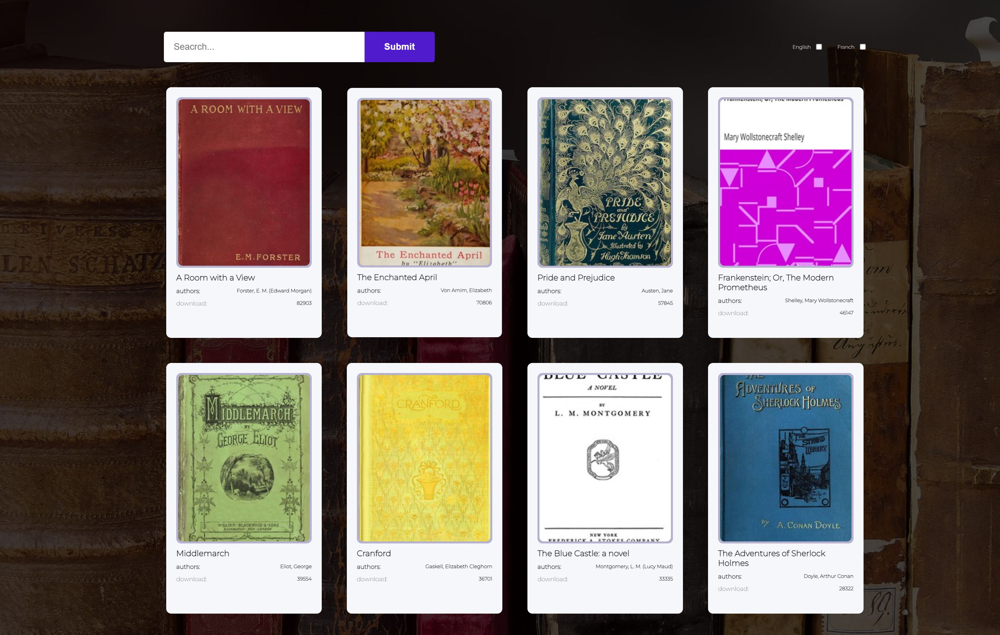
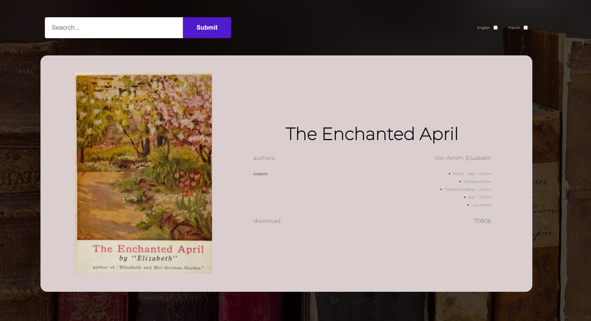

## Implementation :

- The project wrote on NEXT.js;
- For styling use SASS;
- Deploy project on vercel;

## Terms:

- When scrolling, load additional books;
- The page has the ability to search by string;
- The ability to search books by languages;
- Create page books/:id, which is available by clicking on the card with the book;

